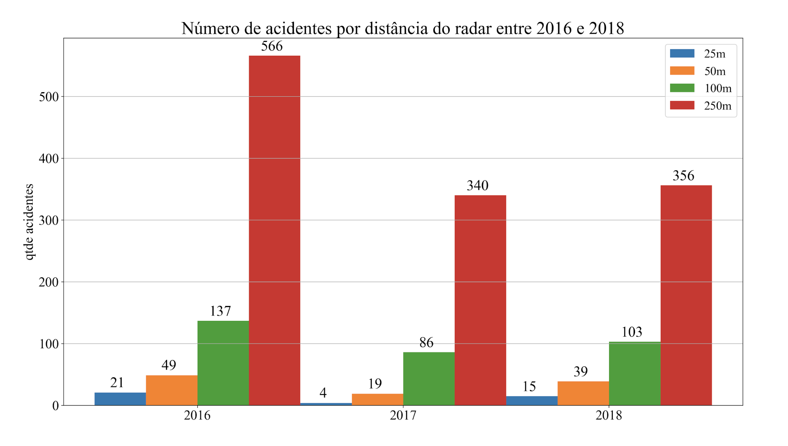
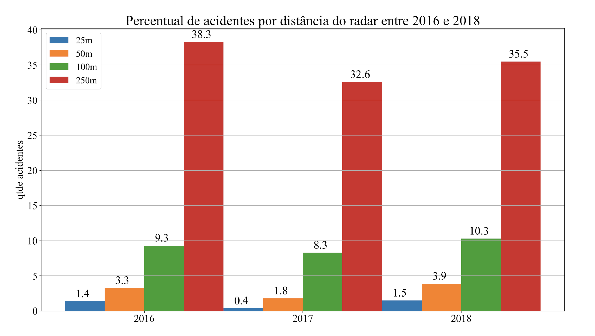

Radartona 2019 - InterSCity team (https://interscity.org/)
===================================================
- Éderson Cassio Lacerda Ferreira (IME-USP)
- Eduardo Felipe Zambom Santana (IME-USP)
- Higor Amario de Souza (IME-USP)
---------------------------------------------------

Desafio Radares x Acidentes

Para relacionar radares com acidentes, o grupo desenvolveu um sistema Web para visualizar as posições de todos os radares da cidade de São Paulo e os acidentes de Fevereiro de 2016, 2017, 2018 e 2019. Esse sistema permite a filtragem dos acidentes por ano ou a exibição de todos os acidentes.

Os radares são exibidos com um buffer de 100 metros para mostrar os acidentes que aconteceram próximo a um radar específico. Outra funcionalidade é ao usuário clicar em um radar, dados sobre esse radar são exibidos como o número de autuações e a contagem de veículos. (Atualmente só está funcionando o número de autuações)

A imagem a seguir mostra a interface da aplicação.

Foram analisados também a quantidade de acidentes que ocorrem dependendo da distância dos radares.

Também foi feita a correlação entre as contagens dos radares dos tipos de veículos nos distritos da cidade e a quantidade de acidentes.

Conclusões

- A nossa análise indica que a presença de radares reduz a quantidade de acidentes que ocorrem nas suas proximidades.

- A instalação de novos radares tem o potencial de reduzir ainda mais o número de acidentes, evitando também a ocorrência de mortes. 
Essa redução pode ter impacto nos gastos com saúde. Esses custos poderiam ser revertidos para a instalação de novos radares.

- As correlações mostram distritos da cidade que devem ser melhor estudados.

- Esse estudo pode ajudar a conscientizar a população sobre a importância dos radares para a segurança viárias.

---------------------------------------------------
Python modules and dependencies
---------------------------------------------------
- psycopg2
- flask
- flask_restful
- unidecode
- utm
- postgresql DB

Para rodar a aplicação basta rodar os seguintes comandos:

cd src
python server.py

---------------------------------------------------
Dados Utilizados
---------------------------------------------------

- Posição dos radares
- Contagem de veículos
- Acidentes
- Distritos